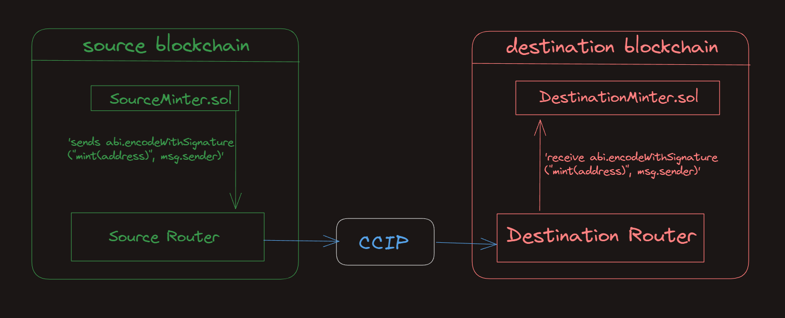
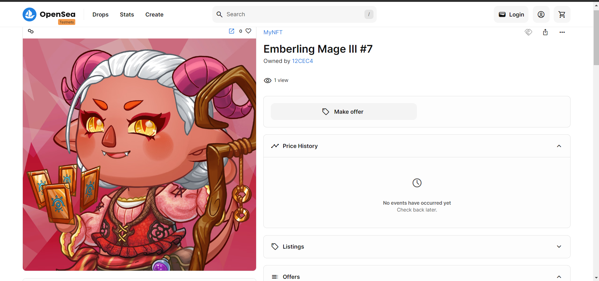

# CCIP Cross Chain NFT

A project to mint an NFT on a chain by trnasferring funds from a different chain using Chainlink CCIP

Verify installation by typing:

## Getting Started

1. Install packages

```
npm install
```

2. Compile contracts

```
npx hardhat compile
```

## Why this product?

If we want to purchase an NFT that is on one chain, but we have funds on some other chain, we will need to use a bridge between the two blockchains. 

Using this dapp, you can mint an NFT on one chain by using your funds on some other supported chain. Currently chainlink ccip supports limited EVM compatible chains so scope of this project is confined to them only.

The basic architecture diagram of what we want to accomplish looks like this:



## Usage

First we need to set up some environment variables.

We are going to use the [`@chainlink/env-enc`](https://www.npmjs.com/package/@chainlink/env-enc) package for extra security. It encrypts sensitive data instead of storing them as plain text in the `.env` file, by creating a new, `.env.enc` file.

1. Set a password for encrypting and decrypting the environment variable file.

```shell
npx env-enc set-pw
```

2. Now set the following environment variables: `PRIVATE_KEY`, Source Blockchain RPC URL, Destination Blockchain RPC URL. You can see available options in the `.env.example` file:

```shell
ETHEREUM_SEPOLIA_RPC_URL=""
OPTIMISM_GOERLI_RPC_URL=""
ARBITRUM_TESTNET_RPC_URL=""
AVALANCHE_FUJI_RPC_URL=""
POLYGON_MUMBAI_RPC_URL=""
PRIVATE_KEY=""
```

To set these variables, type the following command and follow the instructions in the terminal:

```shell
npx env-enc set
```

After you are done, the `.env.enc` file will be automatically generated.

### Deployment

1. Deploy the [`MyNFT.sol`](./contracts/cross-chain-nft-minter/MyNFT.sol) and [`DestinationMinter.sol`](./contracts/cross-chain-nft-minter/DestinationMinter.sol) smart contracts to the **destination blockchain**, by running the `deploy-destination-minter` task:

```shell
npx hardhat deploy-destination-minter
--router <routerAddress> # Optional
```

For example, if you want to mint NFTs on avalancheFuji, run:

```shell
npx hardhat deploy-destination-minter --network avalancheFuji
```

2. Deploy the [`SourceMinter.sol`](./contracts/cross-chain-nft-minter/SourceMinter.sol) smart contract to the **source blockchain**, by running the `deploy-source-minter` task:

```shell
npx hardhat deploy-source-minter
--router <routerAddress> # Optional
--link <linkTokenAddress> # Optional
```

For example, if you want to mint NFTs on avalancheFuji by sending requests from ethereumSepolia, run:

```shell
npx hardhat deploy-source-minter --network ethereumSepolia
```

### Fee Management

3. Fund the [`SourceMinter.sol`](./contracts/cross-chain-nft-minter/SourceMinter.sol) smart contract with tokens for CCIP fees.

- If you want to pay for CCIP fees in Native tokens:

  Open Metamask and fund your contract with Native tokens. For example, if you want to mint from Ethereum Sepolia to Avalanche Fuji, you can send 0.01 Sepolia ETH to the [`SourceMinter.sol`](./contracts/cross-chain-nft-minter/SourceMinter.sol) smart contract.

  Or, you can execute the `fill-sender` task, by running:

```shell
npx hardhat fill-sender
--sender-address <sourceMinterAddress>
--blockchain <blockchain>
--amount <amountToSend>
--pay-fees-in <Native>
```

For example, if you want to fund it with 0.01 Sepolia ETH, run:

```shell
npx hardhat fill-sender --sender-address <SOURCE_MINTER_ADDRESS> --blockchain ethereumSepolia --amount 10000000000000000 --pay-fees-in Native
```

- If you want to pay for CCIP fees in LINK tokens:

  Open Metamask and fund your contract with LINK tokens. For example, if you want to mint from Ethereum Sepolia to Avalanche Fuji, you can send 0.1 Sepolia LINK to the [`SourceMinter.sol`](./contracts/cross-chain-nft-minter/SourceMinter.sol) smart contract.

  Or, you can execute the `fill-sender` task, by running:

```shell
npx hardhat fill-sender
--sender-address <sourceMinterAddress>
--blockchain <blockchain>
--amount <amountToSend>
--pay-fees-in <LINK>
```

For example, if you want to fund it with 0.1 Sepolia LINK, run:

```shell
npx hardhat fill-sender --sender-address <SOURCE_MINTER_ADDRESS> --blockchain ethereumSepolia --amount 100000000000000000 --pay-fees-in LINK
```

### Minting

4. Mint NFTs by calling the `mint()` function of the [`SourceMinter.sol`](./contracts/cross-chain-nft-minter/SourceMinter.sol) smart contract on the **source blockchain**. It will send the CCIP Cross-Chain Message with the ABI-encoded mint function signature from the [`MyNFT.sol`](./contracts/cross-chain-nft-minter/MyNFT.sol) smart contract. The [`DestinationMinter.sol`](./contracts/cross-chain-nft-minter/DestinationMinter.sol) smart contracts will receive the CCIP Cross-Chain Message with the ABI-encoded mint function signature as a payload and call the [`MyNFT.sol`](./contracts/cross-chain-nft-minter/MyNFT.sol) smart contract using it. The [`MyNFT.sol`](./contracts/cross-chain-nft-minter/MyNFT.sol) smart contract will then mint the new NFT to the `msg.sender` account from the `mint()` function of the [`SourceMinter.sol`](./contracts/cross-chain-nft-minter/SourceMinter.sol) smart contract, a.k.a to the account from which you will call the following command:

```shell
npx hardhat cross-chain-mint
--source-minter <sourceMinterAddress>
--source-blockchain <sourceBlockchain>
--destination-blockchain <destinationBlockchain>
--destination-minter <destinationMinterAddress>
--pay-fees-in <Native | LINK>
```

For example, if you want to mint NFTs on Avalanche Fuji by sending requests from Ethereum Sepolia, run:

```shell
npx hardhat cross-chain-mint --source-minter <SOURCE_MINTER_ADDRESS> --source-blockchain ethereumSepolia --destination-blockchain avalancheFuji --destination-minter <DESTNATION_MINTER_ADDRESS> --pay-fees-in Native
```

5. Once the CCIP message is finalized on the destination blockchain, you can query the MyNFTs balance of your account, using the `balance-of` task:


```shell
npx hardhat balance-of
--my-nft <myNftContractAddress>
--blockchain <destinationBlockchain>
--owner <theAccountToCheckBalanceOf>
```

For example, to verify that the new MyNFT was minted, type:

```shell
npx hardhat balance-of --my-nft <MY_NFT_CONTRACT_ADDRESS> --blockchain avalancheFuji --owner <PUT_YOUR_EOA_ADDRESS_HERE>
```

Of course, you can see your newly minted NFT on popular NFT Marketplaces, like OpenSea for instance:



6. You can always withdraw tokens for Chainlink CCIP fees from the [`SourceMinter.sol`](./contracts/cross-chain-nft-minter/SourceMinter.sol) smart contract using the `withdraw` task. Note that the `--token-address` flag is optional. If not provided, native coins will be withdrawn.

```shell
npx hardhat withdraw
--beneficiary <withdrawTo>
--blockchain <sourceMinterBlockchain>
--from <sourceMinterAddress>
--token-address <tokensToWithdraw> # Optional, if left empty native coins will be withdrawn
```

For example, to withdraw tokens previously sent for Chainlink CCIP fees, run:

```shell
npx hardhat withdraw --beneficiary <BENEFICIARY_ADDRESS> --blockchain ethereumSepolia --from <SOURCE_MINTER_ADDRESS>
```

or

```shell
npx hardhat withdraw --beneficiary <BENEFICIARY_ADDRESS> --blockchain ethereumSepolia --from <SOURCE_MINTER_ADDRESS> --token-address 0x779877A7B0D9E8603169DdbD7836e478b4624789
```

depending on whether you filled the [`SourceMinter.sol`](./contracts/cross-chain-nft-minter/SourceMinter.sol) contract with `Native` or `LINK` in step number 3.
